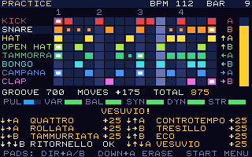
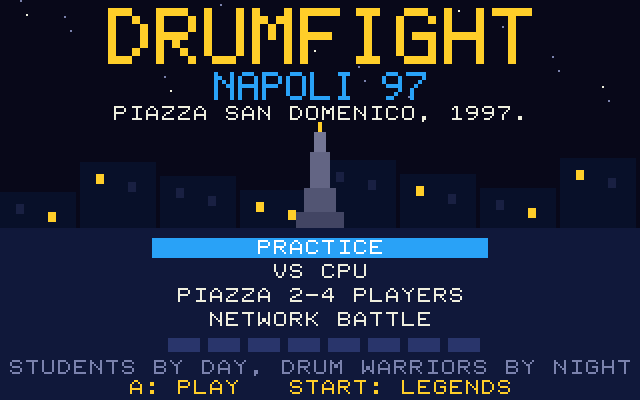
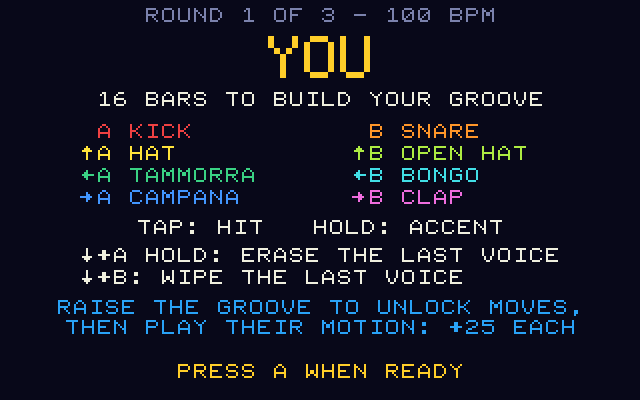
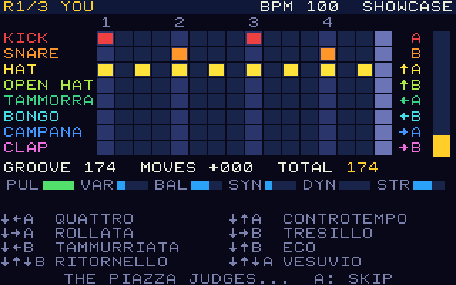
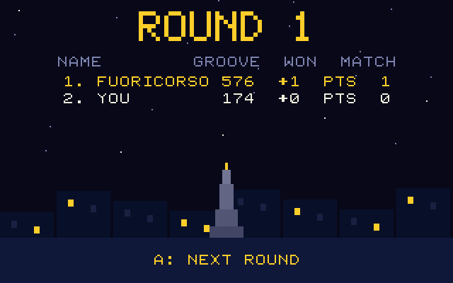

# Drumfight Napoli 97

> During the magical nights of 1997, in the heart of downtown at Piazza San
> Domenico, university students by day became percussion warriors by
> night... The rest of the story? Pure legend!

**Drumfight Napoli 97** is a cartridge for [PRG32](https://github.com/riscv-prg32/PRG32),
the educational ESP32-C6 / RISC-V game console. It is a drum machine you play
like a fighting game: record a one-bar groove live on the eight voices of the
PRG32 SID-like stereo synthesizer, unlock special drum moves with joystick
motions, and let the piazza judge who played it better.



[30-second preview, recorded from the QEMU firmware with its own audio](assets/store/preview.mp4)

| | |
|---|---|
|  |  |
|  |  |

## The game

- **A drum machine.** Eight voices by sixteen steps, looping. Kick, snare,
  hat, open hat, tammorra, bongo, campana and clap, each on its own synth
  channel and its own place in the stereo field. No samples: every sound is
  synthesized.
- **Played live.** A joystick direction plus A or B is a pad. Hits are
  recorded on the nearest sixteenth while the loop keeps playing. Hold the
  button for an accent.
- **Special drum moves.** Raise your groove and eight moves unlock, from
  QUATTRO (four on the floor) to VESUVIO (a full-kit eruption). Each is a
  joystick motion that starts with DOWN, fighting-game style, and is worth
  +25 points.
- **A judge.** Six criteria (pulse, variety, balance, syncopation, dynamics,
  structure) give a groove of 0-999. The rules are deterministic and
  documented in [docs/judge.md](docs/judge.md).

### Modes

| Mode | Players | What happens |
|---|---|---|
| PRACTICE | 1 | Free jam, any tempo, live groove meter; your best groove goes to the scoreboard |
| VS CPU | 1 | Three rounds against MATRICOLA, FUORICORSO or MAESTRO |
| PIAZZA | 2-4, one board | Pass the pad: everyone composes in turn, the piazza ranks the bars |
| NETWORK BATTLE | 2-4 boards | Everyone composes at the same time over the PRG32 multiplayer service |

A match is three rounds at 100, 112 and 124 BPM. Each player has 16 bars to
build a bar; then every pattern is played back and judged.

### Controls

| Input | Action |
|---|---|
| A / B | Kick / snare |
| UP + A / B | Hat / open hat |
| LEFT + A / B | Tammorra / bongo |
| RIGHT + A / B | Campana / clap |
| Hold the button | Accent |
| DOWN + A (hold) | Erase the last played voice under the playhead |
| DOWN + B | Wipe the last played voice |
| DOWN, direction, A or B | Special drum move (see [docs/gameplay.md](docs/gameplay.md)) |
| START | Menu while playing; high scores on the title |

In QEMU: `W` `A` `S` `D` are the joystick, `J` is A, `K` is B, Enter is START.

## Get it running

The Store-ready cartridges are committed in [`dist/`](dist/):

```text
dist/drumfight-napoli97-esp32c6.prg32      ESP32-C6 board
dist/drumfight-napoli97-qemu.prg32         QEMU firmware
dist/drumfight-napoli97-1.0.0-store.zip    Cartridge Store bundle (both variants)
dist/SHA256SUMS
```

On a board running the PRG32 firmware (from a PRG32 checkout):

```bash
python3 -m prg32 esp32c6 upload ../Drumfight-napoli97/dist/drumfight-napoli97-esp32c6.prg32 --url http://192.168.4.1
```

In QEMU:

```bash
python3 -m prg32 qemu upload ../Drumfight-napoli97/dist/drumfight-napoli97-qemu.prg32
```

```bash
python3 -m prg32 qemu run
```

## Build it yourself

With [PRG32](https://github.com/riscv-prg32/PRG32) checked out next to this
repository and the ESP-IDF RISC-V toolchain installed:

```bash
tests/run_tests.sh
```

```bash
scripts/build.sh
```

```bash
scripts/pack-store-bundle.sh
```

The build is deterministic: the same tool versions reproduce
`dist/SHA256SUMS` byte for byte. [docs/reproduce.md](docs/reproduce.md) has
the exact versions, every step and the expected output.

| Budget | Used | Limit |
|---|---|---|
| Executable RAM | 22,500 bytes | 32,768 (PRG32 classroom profile; the default profile has 65,536) |
| Stored package | 28,815 bytes | 65,536 (one cartridge slot) |
| Store bundle | 44,019 bytes | |

## Documentation

| Document | Contents |
|---|---|
| [docs/index.md](docs/index.md) | Map of the documentation |
| [docs/gameplay.md](docs/gameplay.md) | Modes, controls, moves, match flow |
| [docs/judge.md](docs/judge.md) | How a groove is scored; the CPU opponents |
| [docs/audio.md](docs/audio.md) | The eight-voice drum kit and the sequencer clock |
| [docs/multiplayer.md](docs/multiplayer.md) | Pass-the-pad and the network battle protocol |
| [docs/architecture.md](docs/architecture.md) | Source layout, state machine, drawing, portability rules |
| [docs/testing.md](docs/testing.md) | What is tested, on which hosts, and what is not |
| [docs/reproduce.md](docs/reproduce.md) | Rebuilding the released artefacts step by step |
| [docs/store_publishing.md](docs/store_publishing.md) | Bundle format, validation, submission |

## Status

Release 1.0.0. Verified by host tests, on the PRG32-QT emulator core and on
the PRG32 QEMU firmware. **Not yet verified on a physical ESP32-C6**: frame
rate on the SPI display, the sound of the kit through a real speaker, stereo
separation, and a network battle between real boards are open acceptance
items, listed in [docs/testing.md](docs/testing.md).

## Credits and license

Concept and story: Raffaele Montella, University of Naples "Parthenope".
Game design, code, drum kit and pixel art: Claude Code (Anthropic).
The story and its characters are fiction; Piazza San Domenico Maggiore is
real, and so were the drums.

MIT License, see [LICENSE](LICENSE). The host-test font
(`tests/host/font8.h`) is the PRG32 firmware font and the big-title glyph
shapes come from the PRG32-QT host font, both MIT. Several tools are adapted
from the Galleria2007 cartridge of the same project family; each file says
so.
