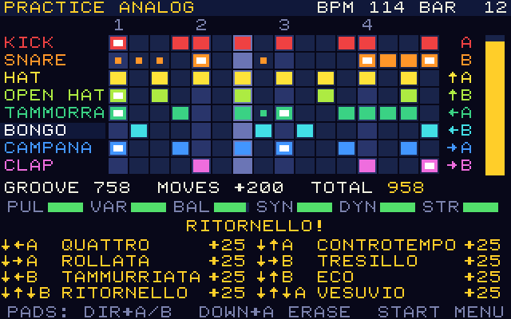
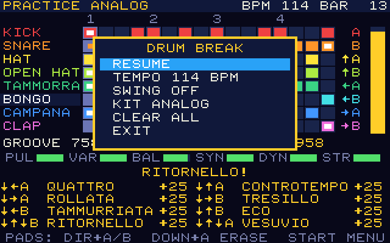

# Gameplay

Drumfight Napoli 97 is a drum machine: one bar of sixteen steps, eight
voices, looping for ever. You do not program it on a grid; you **play** it.

## The screen

- **Grid**: one row per voice, sixteen columns (the digits 1-4 mark the
  beats). A filled cell is a hit, a cell with a white core is an accent, a
  small dot is a ghost note. The bright column is the playhead.
- **Right of the grid**: the pad of each voice (arrow + button) and the
  groove meter.
- **GROOVE / MOVES / TOTAL**: the judge's base score, the bonus for
  performed moves, and their sum (0-999).
- **PUL VAR BAL SYN DYN STR**: the six criteria, see [judge.md](judge.md).
  A bar turns green at 70 or more.
- **Moves panel**: motion, name and state of the eight special moves: a
  number is the groove still needed to unlock it, `OK` means unlocked, `+25`
  means performed.

## Pads

A joystick direction plus a button is a pad:

| | A | B |
|---|---|---|
| no direction | KICK | SNARE |
| UP | HAT | OPEN HAT |
| LEFT | TAMMORRA | BONGO |
| RIGHT | CAMPANA | CLAP |

- A hit is recorded on the **nearest sixteenth**: the step that just played
  or, in the second half of the gap, the next one. You hear the pad at once.
- Playing a step that already sounds changes nothing, so you can drum along
  with your loop.
- **Hold** the button about a fifth of a second and the hit becomes an
  **accent**.
- The voice you played last is the *selected* voice (its name is
  highlighted). Editing and two of the moves act on it.

## Editing

| Input | Action |
|---|---|
| DOWN + A, held | Erase the selected voice under the playhead (hold a whole bar to empty it) |
| DOWN + B | Wipe the selected voice |
| START | Menu: resume, tempo and swing (practice) or done (battles), kit, clear all, exit |

The loop keeps playing while the menu is open, so tempo, swing and kit
(ANALOG or SID, see [audio.md](audio.md)) can be chosen by ear. While the
bar is empty a quiet metronome marks the beats.

## Special drum moves

Every move is a short joystick motion followed by a button, like a special
move in a fighting game. All motions start with DOWN, which is never a pad,
so ordinary drumming cannot trigger one by accident. Each direction must
follow the previous one within 450 ms, and the button within 450 ms of the
last direction.

| Move | Motion | Unlocks at groove | Effect |
|---|---|---|---|
| QUATTRO | DOWN, LEFT + A | 60 | Kick on every beat, accent on the first |
| CONTROTEMPO | DOWN, UP + A | 120 | Open hat on every off-beat eighth |
| ROLLATA | DOWN, RIGHT + A | 190 | Crescendo snare roll on the last beat (ghost, hit, hit, accent) |
| TRESILLO | DOWN, RIGHT + B | 260 | Campana in 3-3-2, twice per bar |
| TAMMURRIATA | DOWN, LEFT + B | 330 | The tammorra figure of the Campanian folk dance |
| ECO | DOWN, UP + B | 400 | Every note of the selected voice echoes three steps later as a ghost note |
| RITORNELLO | DOWN, UP, DOWN + B | 470 | The first half of the selected voice returns as the second half |
| VESUVIO | DOWN, UP, DOWN + A | 540 | A full-kit fill on the last beat that lands on a crash |

- A move **unlocks** when the base groove of the bar you are building first
  reaches its threshold, and stays unlocked for that round.
- A move never erases what you played: it only adds notes or raises levels
  (RITORNELLO is the exception: it replaces the second half of one voice).
- Each *different* move performed in a round adds **+25** to the total.
  Performing a locked motion shows what groove it needs and plays nothing.
- Ghost notes can only come from moves, and the judge rewards them.

## Match flow

1. **Title**: choose a mode with UP/DOWN and A. START shows the
   scoreboard ("Legends of the piazza").
2. **Setup** (VS CPU: opponent; PIAZZA: number of players).
3. For each of **three rounds** (91 BPM, 114 BPM, 114 BPM with swing):
   - *Get ready*: the pad map; A starts.
   - *Compose*: 16 bars, starting from an empty bar. START, DONE ends early.
   - *Showcase*: every bar is played twice while the judge counts up its
     groove. A skips.
   - *Result*: a contestant earns one point for every contestant with a
     strictly lower total.
4. **Final**: most points wins; the best single groove of the match breaks
   ties. The best groove of the local player(s) is submitted to the PRG32
   scoreboard under the game name `drumfight`.

In PRACTICE there are no rounds and no bar limit; the tempo can be changed in
the menu (76, 91, 114 or 152 BPM, swing on or off) and the best groove of the session is
submitted when you exit.

## CPU opponents

| Opponent | Typical total | Character |
|---|---|---|
| MATRICOLA | about 300 | A freshman with a borrowed bongo: a foundation and one move |
| FUORICORSO | about 570 | Ten years of exams, ten of rhythm: three moves |
| MAESTRO | about 840 | The legend of the piazza: six or seven moves |

They follow the same rules as a human; see [judge.md](judge.md).
