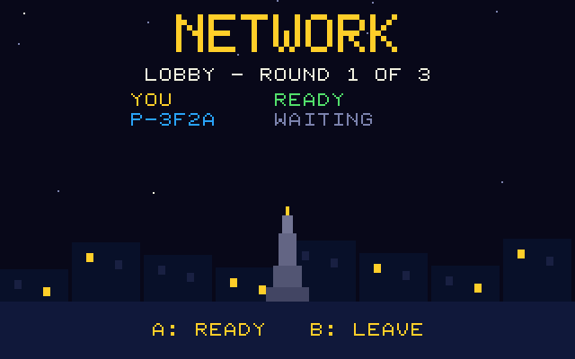

# Multiplayer

Up to four players, in two ways.

## PIAZZA: pass the pad (one board)

Two to four players share one board. In each round they compose in turn
(a "get ready" screen names the next player), then all bars are played back
and ranked. Either controller works at any time: the cartridge merges
player-1 and player-2 buttons, so the pad can be passed or two pads shared.
Nothing is hidden: later players have heard the earlier bars, as in a real
drum circle.

## NETWORK BATTLE (two to four boards)

Each player has a board; everybody composes at the same time.



### What PRG32 provides

`prg32_multiplayer_join("drumfight-napoli97-v1", PRG32_MP_FLAG_ENABLE)`
opts in. Multiplayer is an **optional** feature of the cartridge: it joins
only when the host advertises `PRG32_FEATURE_MULTIPLAYER`, otherwise the
mode shows "NO NETWORK ON THIS HOST". On the ESP32-C6 the firmware relays,
about every 50 ms, the latest snapshot of each player through the PRG32
[MultiplayerServer](https://github.com/riscv-prg32/MultiplayerServer):

```c
int16_t x, y; uint16_t sprite; uint16_t flags; uint32_t input /* 7 bits */;
```

There are no reliable messages and no custom payloads. In QEMU the
firmware's offline stub accepts the join and reports no peers: the lobby
stays empty.

### Snapshot

A pattern is 8 rows of 32 bits plus 8 bits of performed moves: too much for
one snapshot. Every board therefore keeps repeating its state, one voice row
per snapshot (`df_net_pack()` in `src/df_core.h`):

| Field | Bits | Meaning |
|---|---|---|
| `x` | 16 | steps 0-7 of the row, 2 bits per step |
| `y` | 16 | steps 8-15 of the row |
| `sprite` 0-2 | 3 | which voice this row is |
| `sprite` 3-4 | 2 | phase: 0 lobby, 1 composing, 2 done, 3 results |
| `sprite` 5-7 | 3 | round (0-2) |
| `sprite` 8 | 1 | ready |
| `flags` 0-7 | 8 | performed moves |
| `flags` 8-15 | 8 | hash of the whole pattern (FNV-1a folded to 8 bits) |

Each row is held for three frames (about 100 ms) so the 50 ms relay sees
every row; the whole pattern repeats in under a second.

### Receiving

`df_peer_feed()` stores the row. Whenever the advertised hash changes, the
set of received rows is forgotten. A peer's pattern is **complete** only
when all eight rows have arrived since the last hash change *and* the hash
of the assembled pattern equals the advertised one. Lost, repeated and
reordered snapshots are therefore harmless: a stale row can delay
completion, never corrupt a result.

Nobody sends a score. Every board judges every pattern itself with the same
integer judge, so all boards show the same result and a modified cartridge
cannot claim points it did not play.

### Flow

There is no host; the rules are symmetric.

| Step | Rule |
|---|---|
| Lobby | A toggles *ready*. Round 1 starts when this board is ready, at least one peer is present, and every peer present is ready or already composing. The boards present at that moment (at most three peers) are the roster of the match |
| Compose | 16 bars, timed locally. The pattern is broadcast while it is built |
| Wait | After composing, a board advertises *done* and waits until every roster peer is done with a complete pattern. A peer that left stops blocking; after 15 s the board proceeds with what it has, and an incomplete pattern counts as an empty bar |
| Showcase, result | As in the other modes, local player first |
| Next round | A on the result screen is the ready signal for the next lobby; a peer already waiting there still counts as done for the previous round |

Boards do not share a clock: each loops at the round's tempo on its own, and
a few hundred milliseconds between boards do not matter because only
finished bars are compared.

### Compatibility

The signature groups compatible cartridges. Any change to the pattern
format, the snapshot layout, the judge or the moves changes results between
boards and must bump the signature (`NET_SIGNATURE` in `src/drumfight.c` and
`multiplayer_signature` in `metadata/metadata.json`; `tests/run_tests.sh`
checks that they agree).

### Tests and limits

`tests/test_core.c` covers packing round trips, stale rows after a change,
loss/duplication/reordering, and "done" across a round change.
`tests/test_game.c` plays a full three-round battle against a simulated
second board that publishes real snapshots, and a peer that never delivers.

**Not yet tested**: real boards through a real MultiplayerServer. The
simulated peer is ideal (one snapshot per frame); packet loss on Wi-Fi,
three or four boards, and a board joining mid-match are acceptance items in
[testing.md](testing.md).
